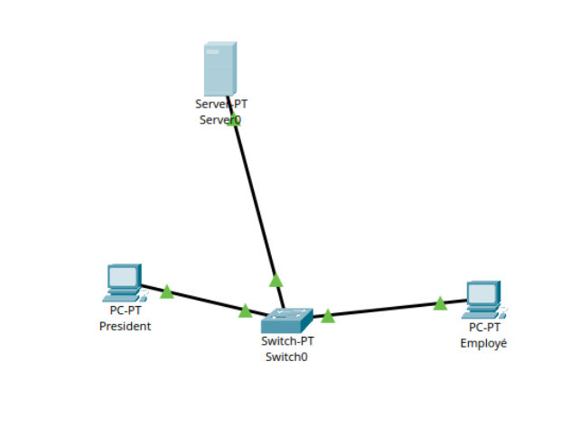

# 1.4 – Ajout d'un PC au réseau

## Problème

Ajouter une seconde carte réseau au serveur permettrait techniquement de connecter un autre PC, mais cette solution n'est pas idéale. Elle complique la configuration, limite l'évolutivité et n'est pas adaptée dès que le réseau grandit.

## Solution : le switch

Ajouter un switch permet de connecter plusieurs machines sur un même réseau local sans modifier la configuration des équipements existants.

## Configuration Packet Tracer

| Machine | Adresse IP |
|---------|-----------|
| PC Directeur | 1.1.1.1 |
| Serveur | 1.1.1.2 |
| PC Employé | 1.1.1.3 |

## Parcours du paquet

PC → Switch → Serveur → réponse sur le chemin inverse.

