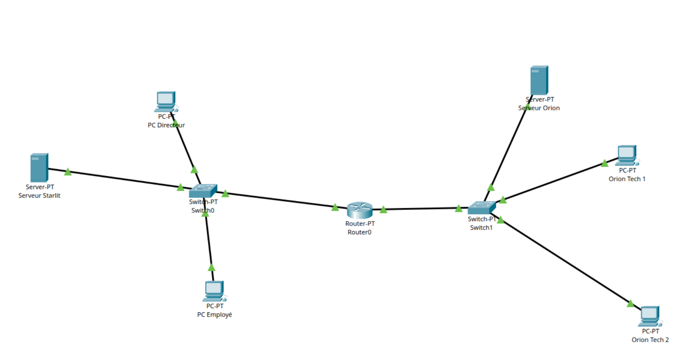

# 1.5 – Connexion avec une autre entreprise

## Problème

Deux réseaux distincts doivent communiquer. Les PC d'OrionTech peuvent communiquer entre eux car ils sont sur le même réseau local. En revanche, la communication avec le réseau de StarLit ne fonctionne pas directement — les machines ne sont pas sur le même réseau IP.

## Solution : le routeur

Les adresses MAC seules ne suffisent pas pour communiquer entre réseaux différents. Un routeur est nécessaire pour relier deux réseaux et acheminer les paquets vers la bonne destination.

## Adressage IP

| Machine | Adresse IP |
|---------|-----------|
| Serveur StarLit | 192.168.0.1/24 |
| PC Directeur StarLit | 192.168.0.2/24 |
| PC Employé StarLit | 192.168.0.3/24 |
| PC OrionTech 1 | 192.168.100.1/24 |
| PC OrionTech 2 | 192.168.100.2/24 |
| Interface routeur côté StarLit | 192.168.0.254/24 |
| Interface routeur côté OrionTech | 192.168.100.254/24 |

## Questions d'adressage

**Adresse réseau 192.168.1.0 :**
- Masque : 255.255.255.0 (/24)
- Adresses utilisables : 254 (première = adresse réseau, dernière = broadcast)

**192.168.1.1/24 et 192.168.24.3/24 sur le même réseau ?**
- Non. Adresses réseau respectives : 192.168.1.0 et 192.168.24.0

## Passerelle par défaut

Chaque machine doit avoir comme passerelle l'adresse IP de l'interface du routeur dans son réseau. C'est ce qui permet d'envoyer des paquets vers un réseau extérieur.

## Parcours du paquet (OrionTech → StarLit)

PC OrionTech → Switch OrionTech → Routeur (interface OrionTech) → Routeur (interface StarLit) → Switch StarLit → Serveur StarLit → réponse sur le chemin inverse.

