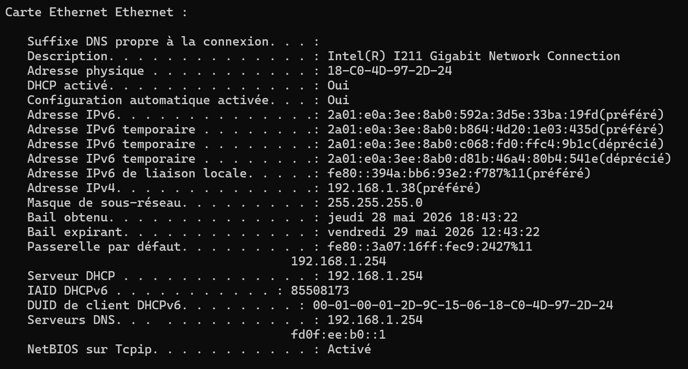
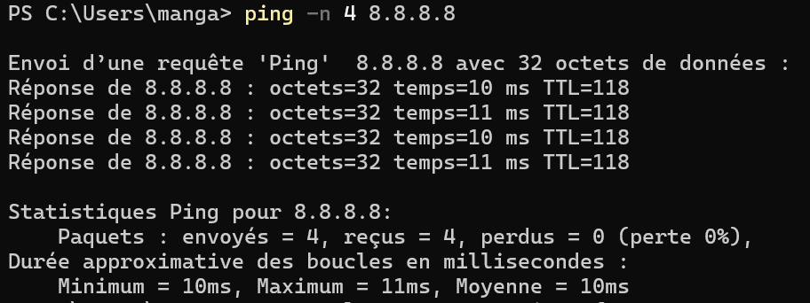
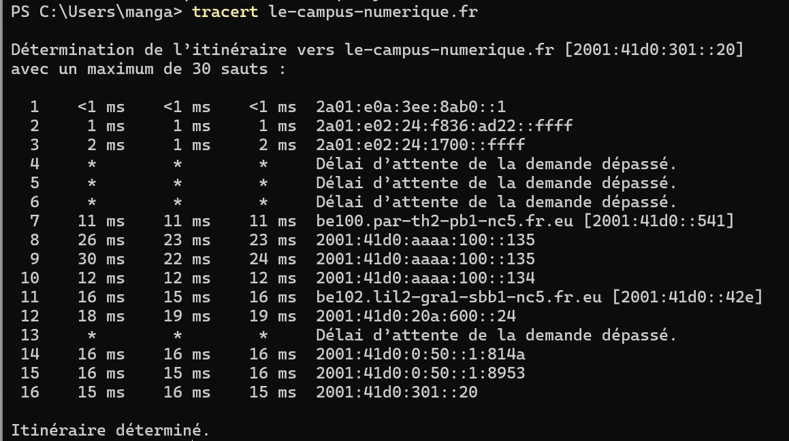

# C2 – Diagnostic réseau d'une machine

## Objectif
Montrer la configuration réseau de la machine, si elle accède à Internet, et par quels nœuds elle passe pour atteindre le site du campus numérique.

---

## 1. Configuration réseau — `ipconfig /all`

| Paramètre | Valeur |
|-----------|--------|
| Nom de la machine | DESFONDS |
| Interface active | Ethernet (Intel I211 Gigabit) |
| Adresse MAC | 18-C0-4D-97-2D-24 |
| Adresse IPv4 | 192.168.1.38 |
| Masque | 255.255.255.0 (/24) |
| Passerelle | 192.168.1.254 |
| Serveur DHCP | 192.168.1.254 |
| Serveur DNS | 192.168.1.254 |

> L'adresse IP est attribuée automatiquement par DHCP. La passerelle et le DNS pointent vers le routeur local.

---

## 2. Accès Internet — `ping -n 4 8.8.8.8`

- 4 paquets envoyés, 4 reçus, 0% de perte
- Latence moyenne : 10ms

> La machine accède bien à Internet.

---

## 3. Nœuds réseau vers le campus — `tracert le-campus-numerique.fr`

Destination : `le-campus-numerique.fr` → `2001:41d0:301::20`

| Saut | IP | Temps |
|------|----|-------|
| 1 | 2a01:e0a:3ee:8ab0::1 (passerelle locale) | <1ms |
| 2 | 2a01:e02:24:f836:ad22::ffff | 1ms |
| 3 | 2a01:e02:24:1700::ffff | 2ms |
| 4-6 | * (routeurs ne répondant pas aux sondes) | — |
| 7 | be100.par-th2-pb1-nc5.fr.eu | 11ms |
| 8-10 | Routeurs OVH intermédiaires | 22-30ms |
| 11 | be102.lil2-gra1-sbb1-nc5.fr.eu | 15ms |
| 16 | 2001:41d0:301::20 (destination) | 15ms |

> 16 sauts pour atteindre le campus, via les routeurs OVH.

