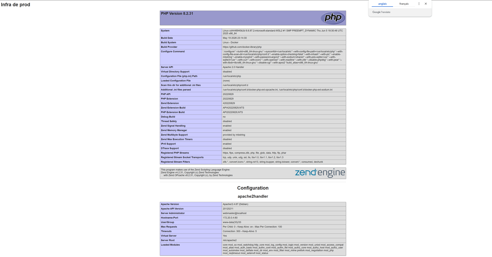
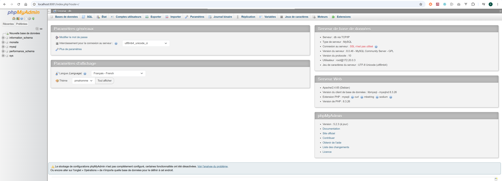
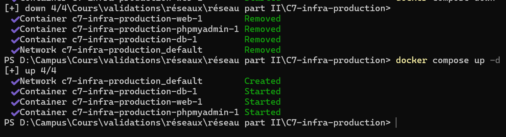

# C7 – Monter une infrastructure de production

## Stack technique

| Service | Image Docker | Port |
|---------|-------------|------|
| Serveur web PHP | php:8.2-apache | 8080 |
| Base de données | mysql:8.0 | 3306 (interne) |
| Interface admin BDD | phpmyadmin/phpmyadmin | 8081 |

## Lancer l'infrastructure

```powershell
docker compose up -d
```

## Arrêter l'infrastructure

```powershell
docker compose down
```

## Accès

- Site PHP : http://localhost:8080
- phpMyAdmin : http://localhost:8081

## Persistance

Le volume `db_data` assure la persistance des données MySQL entre les redémarrages. Le paramètre `restart: always` garantit que les containers redémarrent automatiquement.

## Preuves




